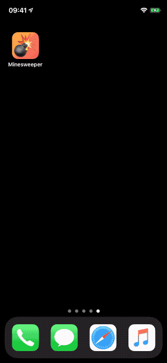

#  Minesweeper

A little iPhone game written using SwiftUI... just because it's simple, but more complex than Tic Tac Toe :-)
Simple tap will uncover a field. Long press will mark field with a flag.  
The game ends as soon as all flags are correctly placed (=win) or if a mine explodes (=lost). 

## Limitations

- Only portrait mode (UI does not rotate/adapt to landscape)
- Hardcoded grid size (currently 10 x 15)
- Difficulty starts at 5 mines and increases constantly by 5 additional mines when field has been successfully cleared.
- Unlimited time and retries

